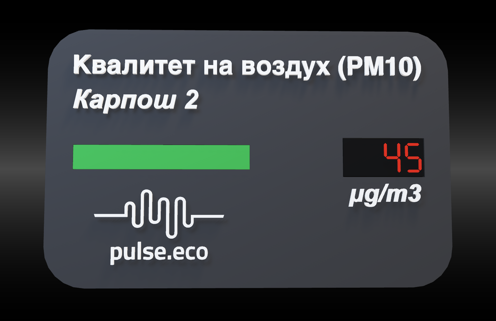
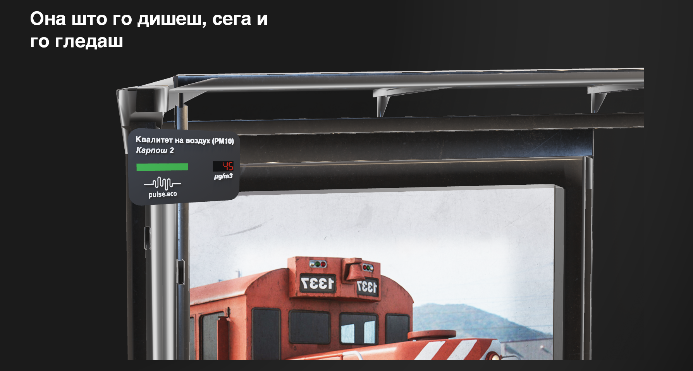

# pulse-stop: Air Pollution Awareness Display

An Arduino-based device designed to display real-time air pollution using the pulse.eco Rest API levels using LEDs and a 4-digit 7-segment display. The device aims to raise awareness about air quality at bus stops throughout the city and promote the Pulse Eco brand.

---



##
 
## Table of Contents

- [Introduction](#introduction)
- [Features](#features)
- [Hardware Requirements](#hardware-requirements)
- [Software Requirements](#software-requirements)
- [3D Models](#3d-models)
- [Setup and Installation](#setup-and-installation)
- [Usage](#usage)
- [Code Explanation](#code-explanation)
- [Troubleshooting](#troubleshooting)
- [Contributing](#contributing)
- [Acknowledgments](#acknowledgments)

---

## Introduction

This project involves creating a compact, Arduino-based device that displays air pollution data received from an ESP8266 module. The device uses an RGB LED to indicate pollution levels through color changes and a 4-digit 7-segment display to show numerical values. It's designed to be placed inside a black box installed at bus stops to inform the public about the current air quality and promote environmental awareness.

---

## Features

- **Real-time Air Pollution Display**: Shows pollution levels on a 4-digit 7-segment display.
- **Visual Alerts**: Uses an RGB LED to indicate pollution severity with different colors.
- **Flipped Display Correction**: Adjusts the display output to compensate for a 180-degree physical flip.
- **Data Reception**: Receives pollution data via serial communication from an ESP8266 module.
- **Scalable Deployment**: Simple setup allows for installation at multiple bus stops citywide.
- **3D-printed Box**: Enviromentaly friendly materials used to make the box which stores the arduinos and all of its components.

---

## Hardware Requirements

- **Arduino Uno** or compatible microcontroller
- **RGB LED** (Common Cathode preferred)
  - **Red Pin** connected to **Pin 9**
  - **Green Pin** connected to **Pin 11**
  - **Blue Pin** connected to **Pin 10**
- **4-Digit 7-Segment Display** (Model: 3642BS with TM1637 driver)
  - **CLK (Clock)** connected to **Pin 13**
  - **DIO (Data I/O)** connected to **Pin 12**
  - **VCC** connected to **5V**
  - **GND** connected to **Ground**
- **ESP8266 Module** (or similar) for data communication
- **Connecting Wires**
- **Breadboard** or **PCB** for assembling the circuit
- **Power Supply** (USB cable or external 5V power source)

---

## Software Requirements

- **Arduino IDE** (version 1.8.x or newer)
- **TM1637Display Library** for controlling the 7-segment display
  - Install via Arduino IDE:
    - Go to **Sketch** -> **Include Library** -> **Manage Libraries...**
    - Search for **TM1637Display** and install the latest version.
- **Similar Installation for the Esp8266 library**

---

## 3D Models

The repository includes Fusion 360 files and 3D models for the enclosure. These files can be used to 3D print or modify the design of the box housing the components.

- **Directory**: `3D-Models/`
- Files included:
  - Fusion 360 project file (`.f3d`)
  - STL files for 3D printing

To view or edit the 3D models, open the Fusion 360 files with Autodesk Fusion 360 or import the STEP files into your preferred 3D modeling software.

---

## Setup and Installation

### 1. Clone the Repository

### 2. Install the Required Libraries

1. Open the Arduino IDE.
2. Navigate to **Sketch** -> **Include Library** -> **Manage Libraries...**.
3. Search for **TM1637Display** and install it.
4. Go to **Settings** ->**Additional Boards Manager URLs** -> Paste this: http://arduino.esp8266.com/stable/package_esp8266com_index.json;
5. Search the esp8266 Library and install it.


---

### 3. Assemble the Hardware

#### Connect the RGB LED:
- **Red Anode** to **Pin 9** (with a current-limiting resistor, e.g., 220Ω).
- **Green Anode** to **Pin 11** (with resistor).
- **Blue Anode** to **Pin 10** (with resistor).
- **Common Cathode** to **Ground**.

#### Connect the 4-Digit 7-Segment Display:
- **CLK** to **Pin 13**.
- **DIO** to **Pin 12**.
- **VCC** to **5V**.
- **GND** to **Ground**.

#### Connect the ESP8266 Module (if applicable):
- Ensure proper voltage levels; use a logic level converter if necessary.
- Make sure that when you are proggraming it to be in programmer mode and when you are sending data flip the RX and TX pins ( RX->TX, TX->RX)

---

### 4. Upload the Code

#### Fetching Code
1. Open `esp_fetching.ino` in the Arduino IDE.
2. Select the correct board and port under **Tools** -> **Board** and **Tools** -> **Port**. (in this case the Generic Esp8266 module).
3. Ensure you are in programmer mode for the Esp8266 module.
4. Click the **Upload** button to program the Arduino.

####  Displaying code
1. Open `Arduino_uno_Led_lights_and_clock.ino` in the Arduino IDE.
2. Select the correct board and port under **Tools** -> **Board** and **Tools** -> **Port**. (in this case the Arduino Uno).
3. Ensure that the ESP8266 module is **NOT** in Programmer Mode, and the pins are RX->RX and TX->TX.
4. Click the **Upload** button to program the Arduino.

---

## Usage

### Power On the Device

- Connect the Arduino to a power source via USB cable or external power supply.

### Data Reception

- The device waits for air pollution data sent over serial communication.
- Ensure the ESP8266 module is programmed to send integer values followed by a newline character (`\n`).

### Display Output

- **7-Segment Display**: Shows the numerical air pollution value.
- **RGB LED Indicators**:
  - **Green**: Safe levels (value ≤ 50).
  - **Yellow**: Moderate levels (50 < value ≤ 90).
  - **Red**: High levels (value > 90).

### Operational Notes

- The device updates the display each time it receives new data.
- After updating, it enters a delay of 10 minutes (`600,000 milliseconds`) before checking for new data.

---

## Code Explanation

### Main Components

- **Arduino_uno_code.ino**: The Arduino code responsible for:
  - Receiving data via serial communication.
  - Controlling the RGB LED based on pollution levels.
  - Displaying values on the 4-digit 7-segment display.
  - Adjusting the display output for a physically flipped module


- **esp8226_module.ino**: The ESP8266 code responsible for:
  - Establishing a Wi-Fi connection to the specified network.
  - Authenticating and fetching data from the Pulse Eco API using HTTPS.
  - Parsing and filtering PM10 sensor data from the API response.
  - Identifying the target sensor by its unique ID and extracting its value.
  -  the PM10 data over serial communication for further processing.


---

## Troubleshooting

### Common Issues

1. **Display Not Showing Values**:
   - Ensure the wiring matches the pin assignments in the code.
   - Verify that the `TM1637Display` library is installed and up-to-date.

2. **RGB LED Not Lighting Up**:
   - Confirm the polarity of the RGB LED (common cathode vs. common anode).
   - Check that appropriate resistors (e.g., 220Ω) are used for each pin.

3. **No Data Reception**:
   - Ensure the ESP8266 module is connected properly and configured to send integer values over serial.
   - Verify the baud rate settings in both the Arduino code and ESP8266 configuration.
   - Verify the pins are RX->TX and TX->RX when trying to send data via Serial.
    


---

## Contributing

##

We welcome contributions to make this project even better. Here's how you can contribute:

1. Fork the repository.
2. Clone your fork locally:

   ```bash
   git clone https://github.com/yourusername/your-repo-name.git

## Acknowledgments

Special thanks to [Jakov Spriovski](https://github.com/dokicaaa) and [Bojan Eftimoski](https://github.com/bojan-eftimoski), co-creators of this repository, for their invaluable contributions and support in building this project.


